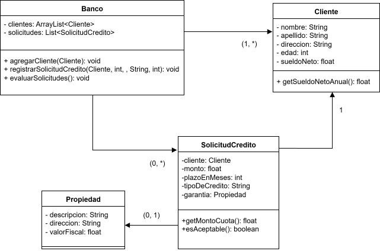
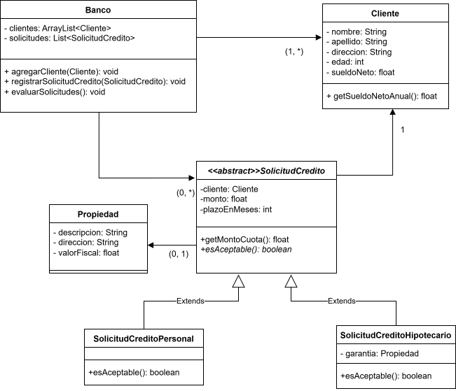

# Caso 2: Bancos y Prestamos

A continuación, se presenta el análisis y la refactorización de un sistema de bancos y prestamos.

---

## 1. Diagrama de Clases UML (Diseño Inicial)

---

## 2. Detección de Violaciones a los Principios SOLID

En el diseño inicial se identificaron las siguientes violaciones clave:

* **Principio de Responsabilidad Única (SRP):** La clase `SolicitudDeCredito` tiene múltiples razones para cambiar. Es responsable tanto de los datos comunes de una solicitud como de conocer las reglas de validación de todos los tipos de crédito (personales, hipotecarios, etc.). Si se modifica una regla o se añade un nuevo tipo de crédito, esta clase debe ser alterada.

* **Principio Abierto/Cerrado (OCP):** El sistema no está cerrado a la modificación. Para extender la funcionalidad (por ejemplo agregar otro tipo de crédito), es necesario modificar el código existente en la clase `SolicitudDeCredito`, probablemente añadiendo más bloques `if/else` en su método de validación.

---

## 3. Soluciones Propuestas

Para corregir las violaciones detectadas, la solución se basa en el uso de abstracción y polimorfismo:

1.  **Crear una Abstracción:** Convertir `SolicitudDeCredito` en una clase **abstracta** que contenga los atributos y comportamientos comunes a todas las solicitudes.
2.  **Definir un Contrato:** La clase abstracta definirá un método `abstract boolean esAceptable()`, obligando a cada subclase a implementar su propia lógica de validación.
3.  **Crear Clases Concretas:** Desarrollar clases específicas que hereden de la clase abstracta, como `SolicitudCreditoPersonal` y `SolicitudCreditoHipotecario`.
4.  **Refactorizar `Banco`:** Modificar la clase `Banco` para que trabaje con la abstracción `SolicitudDeCredito`, utilizando el polimorfismo para evaluar las solicitudes sin conocer su tipo concreto.

---

## 4. Implementación de las Soluciones

A continuación, se muestra el resultado final tras aplicar las soluciones.

### a. Nuevo Diagrama de Clases

