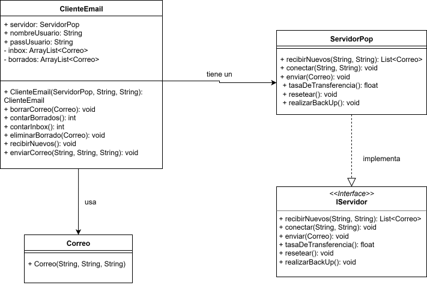
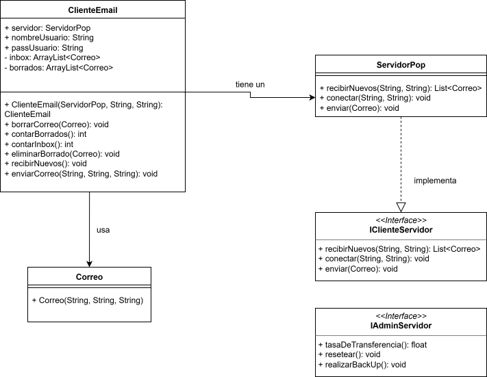

# Caso 1: Cliente de Email

A continuación, se presenta el análisis y la refactorización de un sistema simple de cliente de correo electrónico.

## 1. Diagrama de Clases UML (Diseño Inicial)

---

## 2. Detección de Violaciones a los Principios SOLID

En el diseño inicial se identificaron las siguientes violaciones a los principios SOLID:

* **Principio de Segregación de Interfaces (ISP):** La interfaz `IServidor` obliga a clases como `ServidorPop` a implementar métodos que no son relevantes para su funcionamiento (`tasaDeTransferencia`, `resetear`, `realizarBackUp`), forzando implementaciones vacías o que lanzan excepciones.

* **Principio de Sustitución de Liskov (LSP):** Como consecuencia de la violación de ISP, este principio también se rompe. Un cliente que espera un objeto de tipo `IServidor` no puede sustituirlo de forma segura por un `ServidorPop`, ya que si invoca el método `realizarBackUp()`, el comportamiento no va a ser el esperado (no hará nada).

* **Principio de Inversión de Dependencias (DIP):** El módulo de alto nivel `ClienteEMail` depende directamente de la implementacion de la clase `ServidorPop`. Esto genera que el sistema sea rígido y difícil de extender con nuevos tipos de servidores sin modificar la clase `ClienteEMail`.

---

## 3. Soluciones Propuestas

Para corregir las violaciones detectadas, se proponen los siguientes pasos:

1.  **Segregar la interfaz `IServidor`:** Dividir la interfaz en dos interfaces más pequeñas y cohesivas, basadas en los roles de los clientes:
    * `IClienteServidor`: Contiene las operaciones que un cliente de email necesita (`conectar`, `enviar`, `recibirNuevos`).
    * `IAdminServidor`: Contiene las operaciones de administración (`resetear`, `realizarBackUp`, `tasaDeTransferencia`.).
2.  **Invertir la Dependencia:** Modificar la clase `ClienteEMail` para que dependa de la nueva abstracción `IClienteServidor` en lugar de la clase `ServidorPop`.
3.  **Refactorizar `ServidorPop`:** La clase `ServidorPop` ahora solo implementará la interfaz que le corresponde, `IClienteServidor`.

---

## 4. Implementación de las Soluciones

### a. Nuevo Diagrama de Clases

