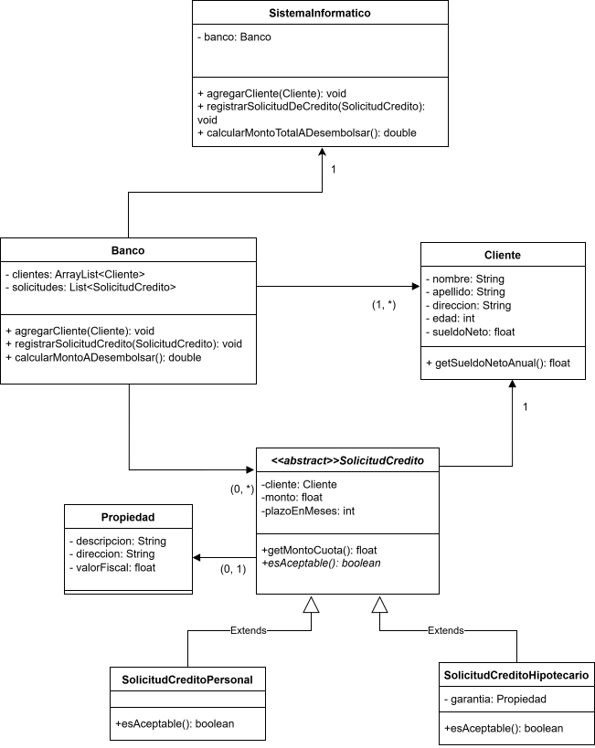

# Caso 3: Sistema Informático para banco

A continuacion se presenta el diseño de un sistema informatico que da soporte a la gestion de Bancos y Prestamos.

---
## 1. Diagrama de Clases UML del Modelo Propuesto

---
## 2. Justificación del Modelo y Principios SOLID

El modelo propuesto fue diseñado para cumplir con los principios SOLID, garantizando un sistema robusto, mantenible y extensible.

* **Principio de Responsabilidad Única (SRP):** Cada clase tiene una única razón para cambiar. La introducción de `SistemaInformatico` mejora la separación de responsabilidades.
    * **Antes**: La clase `Banco` tenía una doble responsabilidad: gestionar las reglas de negocio internas (su dominio) y, a la vez, ser el punto de entrada principal de la aplicación.
    * **Ahora**: La clase `SistemaInformatico` asume el rol de capa de servicio, encargándose de exponer las operaciones principales del sistema. Esto libera a la clase `Banco`, permitiendo que se enfoque exclusivamente en su única responsabilidad: orquestar las reglas del negocio y gestionar sus colecciones de datos.

* **Mantenimiento de Otros Principicios SOLID:** Los demás principios, que ya se cumplían en el diseño del dominio, se mantienen y son aprovechados por esta nueva estructura:

El sistema sigue siendo abierto a la extensión sin modificación (OCP) y cumple con LSP y DIP, ya que el `Banco` continúa dependiendo de la abstracción `SolicitudDeCredito`. La nueva fachada se beneficia de esta flexibilidad sin alterarla.
